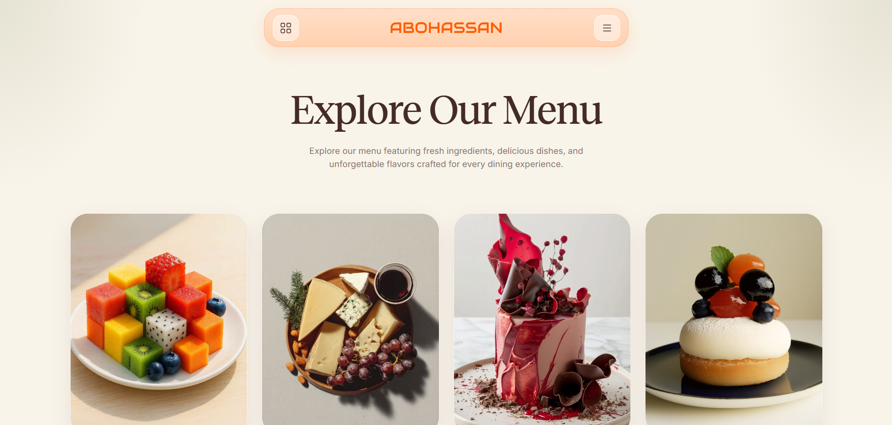
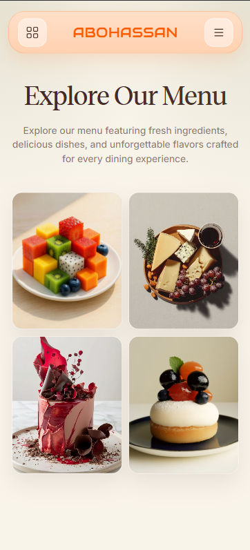

<div align="center">

# 🍽️ Restaurant & Table Reservations Website

A sleek, responsive single-page restaurant website — built with pure HTML, CSS, and vanilla JavaScript. No frameworks, no build step, no dependencies. Just clone it, drop in your own branding, and serve.

[](#)
[](#)
[](#)
[](#)
[](#license)

</div>

<br>
## 🌐 Live Demo

[View the live website](https://malakhub.github.io/Restaurant-Menu-Page/)



---

## ✨ Overview

This template gives any restaurant, café, or eatery a polished, modern web presence out of the box: a hero gallery, a categorized menu, a guest-testimonial carousel, and a reservation form UI — all fully responsive and easy to reskin with your own name, colors, photos, and menu.

> Originally built for a project called **ABOHASSAN**, but every name, image, and menu item is just placeholder content — swap it out and make it your own restaurant's site in minutes.

## 🚀 Features

- 🧭 **Floating pill navigation** — fixed header with a hamburger dropdown, closes on outside click, link click, or `Escape`
- 🖼️ **Hero image gallery** — a 4-image responsive grid with a smooth hover zoom
- 📋 **Categorized menu sections** — item name, description, price, and a hover-triggered dish thumbnail popup
- 💬 **Interactive testimonial carousel** — centered avatar strip, click-to-select guests, highlighted quote text, and reduced-motion support
- 📅 **Reservation form** — client-side submit handling with a temporary confirmation state, ready to connect to your backend of choice
- 🎨 **Custom SVG icon sprite** — every icon inlined once and reused via `<use>`, no icon-font dependency
- ♿ **Accessible by default** — proper `aria-*` attributes, focus-visible outlines, and `prefers-reduced-motion` support
- 📱 **Fully responsive** — clean breakpoints for tablet and mobile

## 🖼️ Preview

<div align="center">

| Desktop | Mobile |
|---|---|
|  |  |

</div>

### 📸 Adding Your Own Screenshots

1. Create a `docs/` folder in the project root.
2. Add your screenshots (e.g. `preview.png`, `screenshot-desktop.png`, `screenshot-mobile.png`) — a full-page capture works well for the main preview, plus one desktop and one mobile shot for the table above.
3. The image paths in this README already point to `docs/`, so they'll pick up automatically once the files are in place.

A quick way to capture a full-page screenshot: open the site in Chrome DevTools → `Cmd/Ctrl+Shift+P` → "Capture full size screenshot".

## 📁 Project Structure

```
.
├── index.html      # Page markup and content
├── style.css       # All styling, layout, and responsive rules
├── main.js         # Nav toggle, testimonial carousel, form handling
├── docs/           # Screenshots for this README (add your own)
└── files/          # Images and fonts referenced by the site
    ├── pic1.jpeg, pic2.avif, pic3.avif, pic4.avif   # Hero gallery
    ├── avatar1.png ... avatar9.png                   # Testimonial avatars
    ├── reservation-bg.jpg                            # Reservation section background
    ├── *.jpeg (dish thumbnails)                      # Menu hover images
    └── RecklessStandardM-TRIAL-Medium.otf             # Heading font
```

> **Note:** The `files/` folder is referenced throughout `index.html` and `style.css` but isn't included in this repo export — make sure it's present alongside these three files before deploying, or images/fonts will be broken.

## 🛠️ Getting Started

No build tools or dependencies are required.

1. Clone or download the repository:

   ```bash
   git clone https://github.com/your-username/your-repo.git
   cd your-repo
   ```

2. Make sure the `files/` directory (images + font) sits next to `index.html`.
3. Open `index.html` directly in a browser, or serve it locally:

   ```bash
   npx serve .
   # or
   python3 -m http.server 8000
   ```

4. Visit `http://localhost:8000` (or wherever your local server points).

## 🎨 Customization

| What | Where |
|---|---|
| Restaurant name & branding | `.logo` text and `<title>` in `index.html` |
| Colors, fonts, spacing | CSS custom properties in `:root` at the top of `style.css` |
| Menu items & prices | `<article class="menu-card">` blocks in `index.html` |
| Testimonials | `data-name`, `data-role`, `data-quote` attributes on each `.avatar` button in `index.html` |
| Contact info & hours | Footer section (`#contact`) in `index.html` |
| Fonts | `@import` (Google Fonts) and `@font-face` (Reckless) at the top of `style.css` |

## 🌐 Browser Support

Built with modern CSS (custom properties, `clamp()`, `aspect-ratio`) and standard DOM APIs. Works in current versions of Chrome, Firefox, Safari, and Edge. No polyfills included for older browsers.

## 🔧 Known Issues / Next Steps

- **Reservation form has no backend.** It currently only simulates success in the browser. To go live, connect the `submit` handler in `main.js` to an API endpoint or a form service (e.g. Formspree, Netlify Forms).
- **Social links** in the footer are placeholder `href="#"` — update with real URLs.
- **Alt text** on menu thumbnail images is currently empty; add descriptive alt text if these images convey meaningful content.

## 📄 License

This project is available under the [MIT License](#) — feel free to use it for personal or commercial projects. Add a `LICENSE` file with the full text before publishing.

## 🙌 Credits

Front-end implementation by **Malak Medhat**.
Fonts: [Inter](https://fonts.google.com/specimen/Inter) and [Audiowide](https://fonts.google.com/specimen/Audiowide) via Google Fonts, plus Reckless Standard (trial).

<div align="center">
  <br>
  <sub>⭐ If you use this template, a star on the repo is always appreciated!</sub>
</div>
